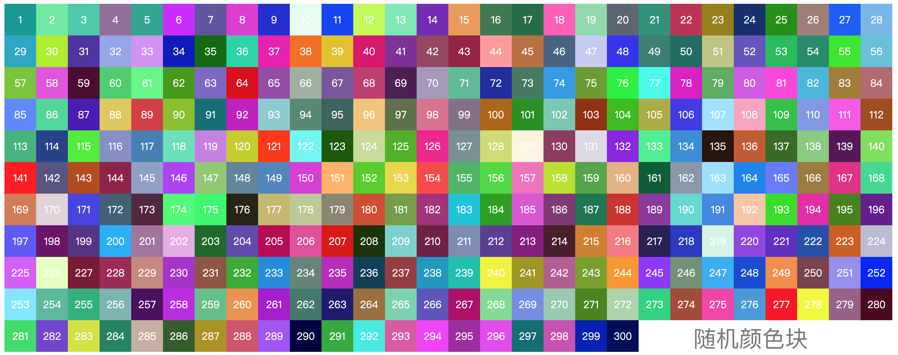
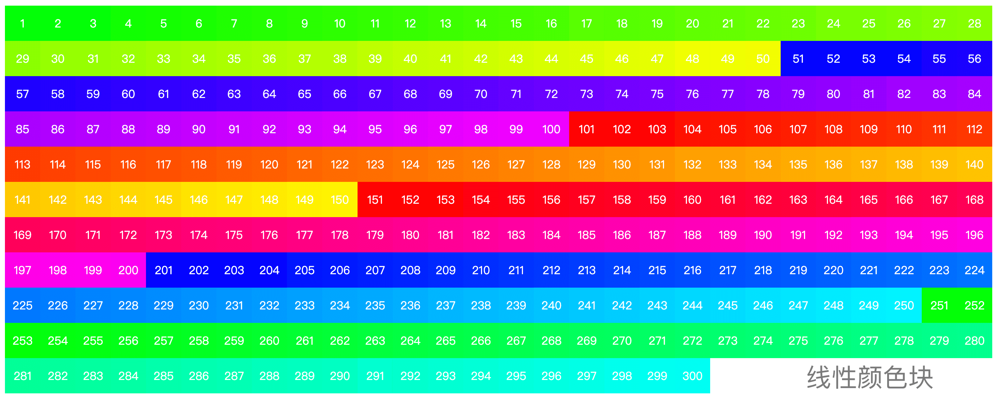

# 随机/线性颜色生成器 RandomColorGenerator

> NPM中已有一个同名的random-color-generator，简单看了下代码，原理很类似。因为命名冲突，于是我的名称为random-color-generator2。

本示例中使用了大量的Generator，在写的过程发现ES6所提供的Generator在这个场景中非常适用。可以参考学习。

 > 代码量非常小，压缩后只有3.9kb，解压后也只有12kb。

## 随机示例


##### 文本示例
|Index|	Color|
|:-:|:-:|
|0	|'#b2c7f1'|
|1	|'#f5aca4'|
|2	|'#708b86'|
|3	|'#b7642d'|
|4	|'#affb04'|

## 线性示例


##### 文本示例
|Index|	Color|
|:-:|:-:|
|0	|'#00FF00'|
|1	|'#02FF00'|
|2	|'#04FF00'|
|3	|'#06FF00'|
|4	|'#08FF00'|

## How to use
```
    npm install random-color-generator2
```
### For random color
```javascript
    const { generateColor } = require('random-color-generator2');

    const colorPointer = generateColor(false);

    // generate a random color, 调用无次数限制
    const color = colorPointer.next().value;
```

### For linear color
```javascript
    const { generateColor } = require('random-color-generator2');

    // 注意参数
    const colorPointer = generateColor(true, 2);

    // generate a linear color
    const color = colorPointer.next().value;
```

 > 可以无限调动，没有限制。

### For Chrome Runtime

对浏览器环境专门生成了对应文件，路径为: ```/lib/bundle.js```。如下为使用参考示例：
```html
    <script src="/lib/bundle.js"></script>
```

浏览器环境的方法是挂在到rcg2对象下的，所以需要通过rcg2调用：

```
    // 生成线性色, 步长为5
    const pointer = rcg2.generateColor(true, 5);
    const color = pointer.next().value;
```

 > 如有疑问，可以参见项目中的```index.html```示例文件。

## 对generateColor方法及颜色模板的说明
generateColor方法有两个参数.

 - 参数1，类型为boolean值，表示是否开启线性输出。
 - 参数2，类型为整型，表示线性输出情况下颜色的增量区间。例如这个值传入3，在第一个值为#00FF00的情况下，第二个值就为03FF00，以此类推。

颜色模板的排列组合为: XXFF00 XX00FF FFXX00 FF00XX 00XXFF 00FFXX，目前从这6个中循环取模板，后期将支持自定义模板。

## 分治算法求排列组合

在实现线性递增的过程中，需要了解情况线性颜色的变化方式，在观察了[ADOBE](https://color.adobe.com/create)对于颜色的变化方式之后，知道需要有一个模板的排列组合。虽然这里需要的只有6种，不用多长时间就可以穷举出来，但是我还是想通过分治的方法将所有的可能列出来。

实现代码如下：
```javascript
// 分治算法计算所有的颜色模板值
function generateColorTemplate(array) {

    // 出口
    if (array.length === 1)
        return array;

    const resultArray = [];
    for (let index = 0; index < array.length; index++) {
        const firstEle = array[index];

        const shadow = array.slice();
        shadow.splice(array.indexOf(firstEle), 1);
        const temp = generateColorTemplate(shadow);

        // 组合
        for (let indexJ = 0; indexJ < temp.length; indexJ++) {
            const secondEle = temp[indexJ];
            resultArray.push(`${firstEle}${secondEle}`);
        }
    }
    return resultArray;
}
```

测试方式如下：
```javascript
// test.js
const { generateColorTemplate } = require('./src/index.js');

const result = generateColorTemplate(['A', 'B', 'C', 'D', 'E']);

console.info(result.join(' '), result.length);
```

对于5个元素的排列组合为: 5的阶层, 也就是 5 x 4 x 3 x 2 x 1 = 120.
最终的结果经过多轮测试是正确的:
```
ABCDE ABCED ABDCE ABDEC ABECD ABEDC ACBDE ACBED ACDBE ACDEB ACEBD ACEDB ADB
CE ADBEC ADCBE ADCEB ADEBC ADECB AEBCD AEBDC AECBD AECDB AEDBC AEDCB BACDE 
BACED BADCE BADEC BAECD BAEDC BCADE BCAED BCDAE BCDEA BCEAD BCEDA BDACE BDA
EC BDCAE BDCEA BDEAC BDECA BEACD BEADC BECAD BECDA BEDAC BEDCA CABDE CABED 
CADBE CADEB CAEBD CAEDB CBADE CBAED CBDAE CBDEA CBEAD CBEDA CDABE CDAEB CDB
AE CDBEA CDEAB CDEBA CEABD CEADB CEBAD CEBDA CEDAB CEDBA DABCE DABEC DACBE 
DACEB DAEBC DAECB DBACE DBAEC DBCAE DBCEA DBEAC DBECA DCABE DCAEB DCBAE DCB
EA DCEAB DCEBA DEABC DEACB DEBAC DEBCA DECAB DECBA EABCD EABDC EACBD EACDB 
EADBC EADCB EBACD EBADC EBCAD EBCDA EBDAC EBDCA ECABD ECADB ECBAD ECBDA ECD
AB ECDBA EDABC EDACB EDBAC EDBCA EDCAB EDCBA 120
```

对于这种场景使用分治算法求排列组合非常合适。

----
代码已经上传Github，地址为：[Random Color Generator](https://github.com/sahadev/RandomColorGenerator.git)
项目已发布至NPM，地址为：[random-color-generator2](https://www.npmjs.com/package/random-color-generator2)

TODOLIST:
 - 支持颜色模板可配置. 例如支持XXFFFF/XX0000/FFXXFF...
 - 支持步长可配置. 支持单次递增变化值: 1 ~ 255
 - 支持颜色随机范围可配置. 例如支持100 ~ 150的颜色范围区间
 - 支持递减