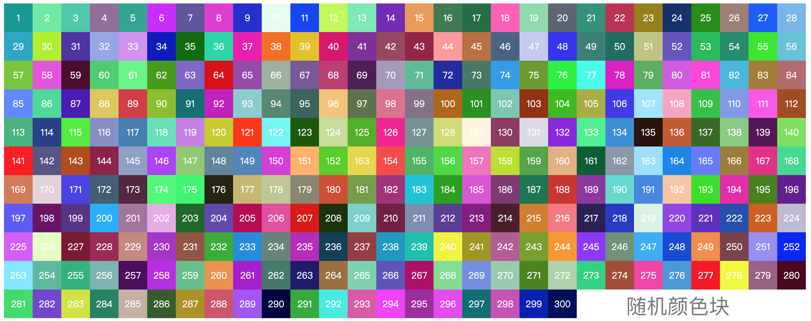
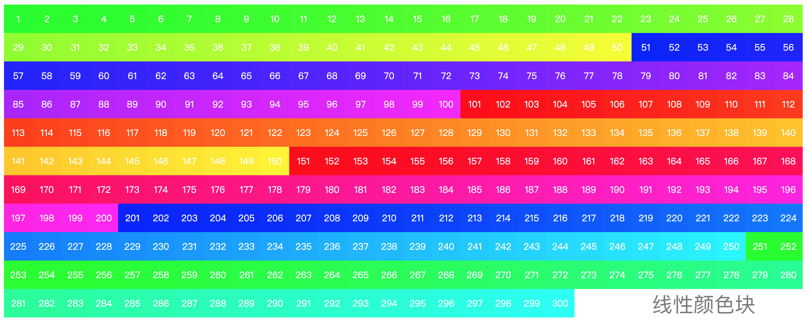

# 随机/线性颜色生成器 RandomColorGenerator

> NPM中已有一个同名的random-color-generator，简单看了下代码，原理很类似。于是我的名称为random-color-generator2

<style>
    .block {
        display: inline-block;
        width: 20px;
        height: 20px;
        text-align: center;
        color: white;
        line-height: 20px;
    }
</style>

<div id="container">
    <div class="block" style="background-color: #d35576">1</div>
    <div class="block" style="background-color: #223691">2</div>
    <div class="block" style="background-color: #a82df7">3</div
    >
</div>


最近在实现[https://javascript30.com/](https://javascript30.com/)的课程，其中有一门课程要求利用Canvas实现一个效果，我发现这个效果其中的颜色是线性生成的。结合我之前已经写过一个随机颜色生成器，就想将这个随机颜色生成器写出来，作为一个工具使用，虽然实际应用场景不大，就当练练手了。

本示例中使用了大量的Generator，在写的过程发现ES6所提供的Generator在这个场景中非常适用。可以参考学习。

## How to use
```
    npm install random-color-generator2
```
### For random color
```javascript
    const { generatorColor } from 'random-color-generator2'

    const colorPointer = generatorColor(false);

    // generate a random color
    pointer.next().value;
```

### For linear color
```javascript
    const { generatorColor } from 'random-color-generator2'

    const colorPointer = generatorColor(true);

    // generate a random color
    pointer.next().value;
```

## 示例-随机生成一个颜色


在浏览器中这么使用:
```
const pointer = generatorColor(false);
const color = pointer.next().value;
// color即为这次返回的随机值
```
我的示例中使用了300个颜色块，所以颜色呈现上图效果。

## 示例-返回线性递增颜色


在浏览器中这么使用:
```
const totolBlock = 300;// 300个颜色块
const pointer = generatorColor(true, Math.round(totolBlock / 6))); // 因为XX/FF/00有6中排列组合，所以300除以6便是每个组合的颜色模板，例如XXFF00会依次递增生成50个颜色。依次类推。
const color = pointer.next().value;
// color即为这次返回的随机值
```
我的示例中使用了300个颜色块，所以颜色呈现上图效果。

具体看示例的index.html文件

## 分治算法求排列组合

在实现线性递增的过程中，需要了解情况线性颜色的变化方式，在观察了[ADOBE](https://color.adobe.com/create)对于颜色的变化方式之后，知道需要有一个模板的排列组合。虽然这里需要的只有6种，不用多长时间就可以穷举出来，但是我还是想通过分治的方法将所有的可能列出来。

实现代码如下：
```javascript
// index.js
// 分治算法计算所有的颜色模板值
function generatorColorTemplate(array) {
    if (array.length === 1)
        return array;

    const resultArray = [];
    for (let index = 0; index < array.length; index++) {
        const element = array[index];

        const shadow = array.slice();
        shadow.splice(array.indexOf(element), 1)
        const temp = generatorColorTemplate(shadow);

        for (let indexJ = 0; indexJ < temp.length; indexJ++) {
            const element2 = temp[indexJ];
            resultArray.push(`${element}${element2}`);
        }

    }
    return resultArray;
}
```

测试方式如下：
```javascript
// test.js
const { generatorColorTemplate } = require('./index');

const result = generatorColorTemplate(['A', 'B', 'C', 'D', 'E']);

console.info(result.join(' '), result.length);
```

对于5个元素的排列组合为:5的阶层，也就是 5*4*3*2*1 = 120.
最终的结果经过多轮测试是正确的:
```
ABCDE ABCED ABDCE ABDEC ABECD ABEDC ACBDE ACBED ACDBE ACDEB ACEBD ACEDB ADB
CE ADBEC ADCBE ADCEB ADEBC ADECB AEBCD AEBDC AECBD AECDB AEDBC AEDCB BACDE 
BACED BADCE BADEC BAECD BAEDC BCADE BCAED BCDAE BCDEA BCEAD BCEDA BDACE BDA
EC BDCAE BDCEA BDEAC BDECA BEACD BEADC BECAD BECDA BEDAC BEDCA CABDE CABED 
CADBE CADEB CAEBD CAEDB CBADE CBAED CBDAE CBDEA CBEAD CBEDA CDABE CDAEB CDB
AE CDBEA CDEAB CDEBA CEABD CEADB CEBAD CEBDA CEDAB CEDBA DABCE DABEC DACBE 
DACEB DAEBC DAECB DBACE DBAEC DBCAE DBCEA DBEAC DBECA DCABE DCAEB DCBAE DCB
EA DCEAB DCEBA DEABC DEACB DEBAC DEBCA DECAB DECBA EABCD EABDC EACBD EACDB 
EADBC EADCB EBACD EBADC EBCAD EBCDA EBDAC EBDCA ECABD ECADB ECBAD ECBDA ECD
AB ECDBA EDABC EDACB EDBAC EDBCA EDCAB EDCBA 120
```

对于这种场景使用分治算法求排列组合非常合适。

----
代码已经上传Github，地址为：[Random Color Generator](https://github.com/sahadev/RandomColorGenerator.git)
随后会将这个包上传至NPM，供大家使用。